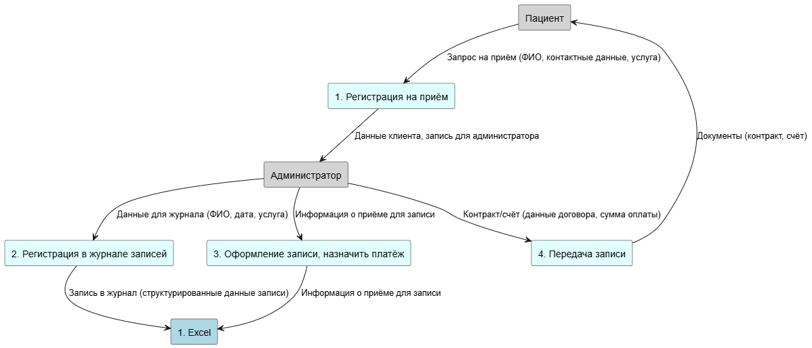
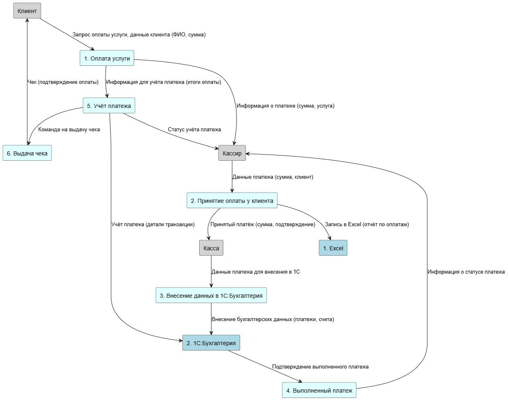
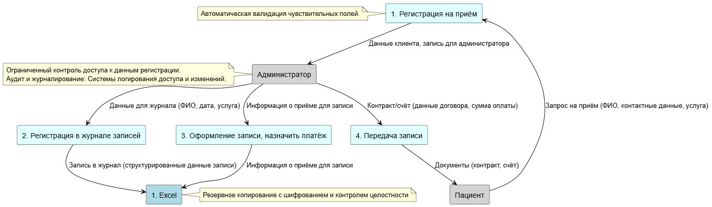
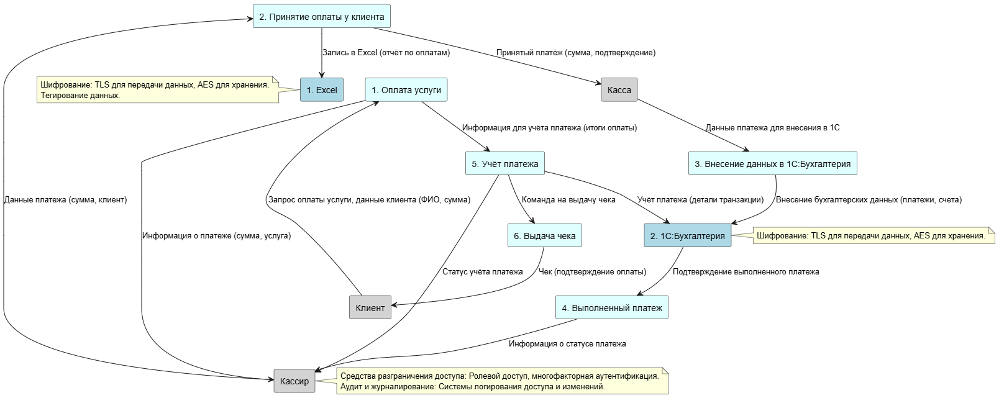

# Задание 1. Анализ безопасности системы

### Диаграммы потоков данных

Запись

Оплата

Прием

### Аудит мер по обеспечению безопасности данных

нализ выявляет серьёзные проблемы, связанные с защитой данных, соблюдением конфиденциальности и информационной безопасностью, которые требуют немедленного внимания.

## Определённые конфиденциальные элементы данных

### 1. Личная информация пациента
- Полное имя ([translate:ФИО])
- Дата рождения
- Адрес
- Контактная информация
- Номер медицинского страхования ([translate:номер полиса ОМС])

### 2. Медицинские данные
- История болезни
- Информация о диагнозах
- Результаты лабораторных исследований
- Записи о лечении
- Данные о рецептах

### 3. Финансовая информация
- Суммы платежей
- Методы оплаты
- Временные метки транзакций
- Информация по квитанциям

### 4. Операционные данные
- Расписания приёмов
- Назначения персонала
- Детали услуг
- Информация по выставлению счетов

## Критические проблемы безопасности
Текущая архитектура системы представляет собой значительные риски безопасности и конфиденциальности, которые могут привести к утечкам данных, штрафным санкциям и снижению доверия пациентов.

[Cписок проблемных зон](problems.md)

### Список данных для защиты и способы защиты
| Тип данных                                                      | Способ защиты                   |
| --------------------------------------------------------------- | ------------------------------- |
| Персональные данные клиентов/пациентов (ФИО, контактные данные) | Шифрование, обезличивание       |
| Платёжные данные (суммы, подтверждения, счета)                  | Шифрование, обфускация          |
| Медицинские данные (жалобы, диагнозы, анализы)                  | Шифрование, обезличивание       |
| Журналы приёмов, карточки пациентов                             | Шифрование, ограничение доступа |
| Данные бухгалтерии (транзакции, учет платежей)                  | Шифрование, контроль доступа    |

- Шифрование должно применяться как к данным в покое, так и при передаче.
- Обезличивание используется для аналитики и статистики, чтобы исключить идентификацию.
- Обфускация применима для скрытия счётных данных и предотвращения копирования.

### Механизм тегирования данных
- Использовать систематическое тегирование каждого элемента данных (например, персональные, медицинские, платёжные) с детальной категоризацией.
- Применять инструменты тегирования данных, такие как Google Tag Manager, Яндекс Тег Менеджер, или специализированные DLP-системы.
- Теги включают свойства: уровень конфиденциальности, требования по хранению, политику доступа.
- Механизм должен автоматически связывать теги с данными при их создании или изменении, обеспечивая контроль и мониторинг защиты.

### Инструменты, способы и меры защиты конфиденциальности
- Шифрование: TLS для передачи данных, AES для хранения.
- Средства разграничения доступа: Ролевой доступ, многофакторная аутентификация.
- Аудит и журналирование: Системы логирования доступа и изменений.
- Защита и мониторинг: DLP (Data Loss Prevention), SIEM системы.
- Обезличивание: Маскирование, токенизация персональных данных.
- Тегирование данных: Google Tag Manager, Яндекс Тег Менеджер, специализированные корпоративные решения.
- Резервное копирование с шифрованием и контролем целостности.

### Доработанные диаграммы потоков данных
Запись

Оплата

Прием

[Назад к списку заданий](../README.md)