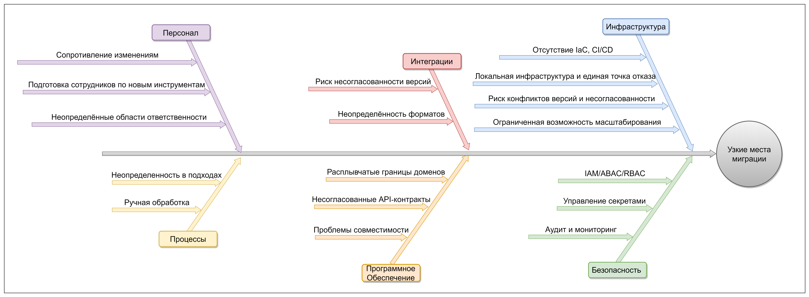

# Задание 4. Оценка узких мест при миграции

## Инфраструктура
- Постепенный переход сервисов на Kubernetes, внедрениями CI/CD, автоматическое тестирование API.
- Оценить необходимость переезда в облако или создание гибридной инфраструктуры.

## Безопасность
- Внедрить централизованный IAM/IDAM с RBAC и ABAC, интегрированный с Active Directory и API-шлюзами.
- Реализовать аудит доступа и мониторинг, сбор и анализ событий, оповещения при несанкционированном доступе.
- Разработать политику по минимальным привилегиям и защищенным данным в API-контрактах.

## Интеграции
- Планировать переход к микросервисной архитектуре по принципу границ доменов: портал, платежи, CRM, лабораторная интеграция, BI/AI-слои
- Необходимо формализовать API-слой для интеграций, лаборатория анализов, платежи, CRM, портал

## Программное обеспечение
- Разделить данные по доменам на основе чувствительности: общие данные клиента, персональные данные пациентов, финансовые данные, медицинская информация, логи и аудиты.
- Разработать концепцию API-контрактов для интеграций с лабораторией и клиентскими порталами, включив ограничения доступа и тестовые сценарии
- Заменить хранения в Excel на БД

## Персонал
- Составить план обучения сотрудников
- Составить регламенты управления изменениями
- Определить и разделить роли и ответственности по проект

## Процессы
- Описать и поддерживать актуальные регламенты (SOP): сбор, хранение, доступ, удаление данных
- Для каждой роли зафиксировать минимально необходимый набор данных/доступов
- Автоматизировать запись пациентов и сопутствующие уведомления

[Назад к списку заданий](../README.md)